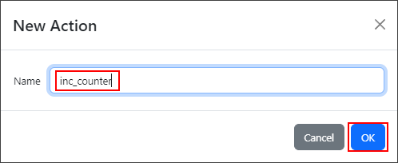
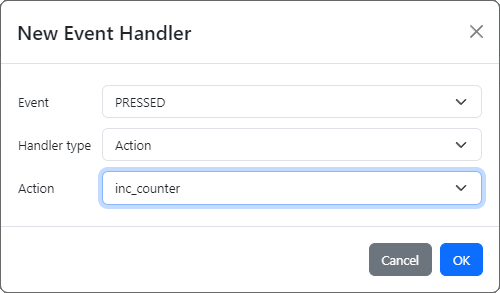
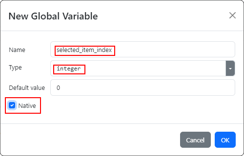
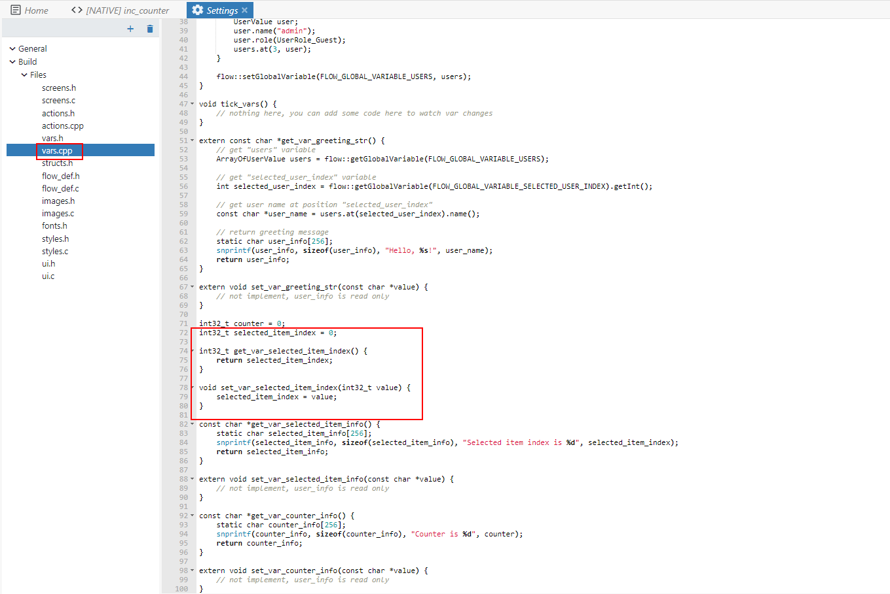

# Example of native interface between EEZ Studio and LVGL when EEZ Flow is used

## User actions

In LVGL project with EEZ Flow you can define user actions that can be attached to the event handlers. You are doing this in 4 steps:

- Step 1: Add user actions
  
  Go to User Actions tab, press + button, enter the name of user action and press OK:

  

  

- Step 2: Set the "Implementation type" property of user action to "Native"

  

  Note: You can still provide flow implementation of native function. This implemenentation will be used when running project inside EEZ Studio with the Run button.

- Step 3: Create event handler and attach it to the user action

  Select widget, for example Button, and in properties find Events section and press + button:

  
  
  Now, select event and user action and press OK:

  

- Step 4: Implement user action in C

  You need to implement in C++ function called `void action_<user action name>(lv_event_t * e)`. For example, if user action is called `inc_counter` you need to implement `void action_inc_counter(lv_event_t * e);`. Declaration of all user actions can be found in generated file `actions.h`. You can implement user actions in any C file or you can add `actions.cpp` file template in your project like this:

  

## Variables

In LVGL project with EEZ Flow you can define native global variables with the get/set functions that you must implement in C++. You are doing this in 3 steps:

- Step 1: Add global variable

  Go to Variables tab, select Global, press + button, enter the name and type of variable and press OK:

  

  

- Step 2: Use variable inside widget

  

- Step 3: Implement get and set functions in C++

  You need to implement in C++, for each variable, functions called `<variable type> get_var_<variable name>()` and `void set_var_<variable name>(<variable_type> value)`. For example, if variable is called `selected_item` and type is `integer` you need to implement `int32_t get_var_selected_item();` and `void set_var_selected_item(int32_t value)`. Function declarations for all variables can be found in generated file `vars.h`. You can implement these functions in any C++ file or you can add `vars.cpp` file template in your project like this:

  

## Accessing flow variables from the native code

Chech the [`vars.cpp`](https://github.com/eez-open/native-interface-lvgl-with-flow/blob/master/src/ui/vars.cpp) file to see how can you **set flow variable value** from native code (check function [`init_vars`](https://github.com/eez-open/native-interface-lvgl-with-flow/blob/master/src/ui/vars.cpp#L9) from [`vars.cpp`](https://github.com/eez-open/native-interface-lvgl-with-flow/blob/master/src/ui/vars.cpp)), or how can you **get flow variable value** from natiave code (check function [`get_var_greeting_str`](https://github.com/eez-open/native-interface-lvgl-with-flow/blob/master/src/ui/vars.cpp#L44) from [`vars.cpp`](https://github.com/eez-open/native-interface-lvgl-with-flow/blob/master/src/ui/vars.cpp)).

## How to build project

### Install SDL

Downlad [SDL](https://www.libsdl.org/) (a graphics library to open a window and handle the mouse). On Linux:
1. Find the current version of SDL2: `apt-cache search libsdl2 (e.g. libsdl2-2.0-0)`
2. Install SDL2: `sudo apt-get install libsdl2-2.0-0` (replace with the found version)
3. Install SDL2 development package: `sudo apt-get install libsdl2-dev`
4. If build essentials are not installed yet: `sudo apt-get install build-essential`

### Install Emscripten SDK
Download the [Emscripten SDK](https://kripken.github.io/emscripten-site/) and make sure it is in your PATH.

1. `git clone https://github.com/emscripten-core/emsdk.git`
2. `cd <path-to-emsdk>`
3. `git pull`
4. `./emsdk install latest`
5. `./emsdk activate latest`
6. `source ./emsdk_env.sh`

More info here: https://kripken.github.io/emscripten-site/docs/getting_started/downloads.html

### Build the project
1. `cd C:\work\eez\native-interface-lvgl-no-flow`
2. `mkdir build`
3. `cd build`
4. `emcmake cmake ..`
5. `emmake make -j4`
6. A file called `index.html` will be generated. Run this in your browser.
